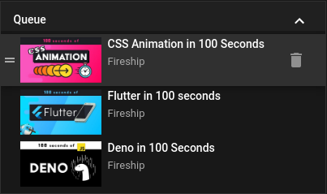
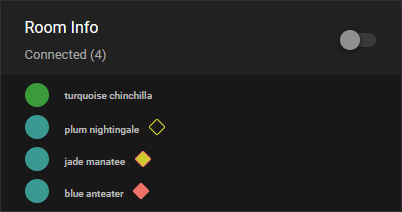

<p align="center">
  <image src="https://github.com/Tandashi/YTSync-Plugin/blob/master/doc/title.png?raw=true">
</p>
<p align="center">
  
  
</p>

<br/>

<p align="center">
  <a href="https://chrome.google.com/webstore/detail/ytsync/djjmipmoebdhkblgmllkehfghaekbimi">
    
  </a>
  <br/>
  
  
</p>
<p align="center">
  <a href="https://addons.mozilla.org/en-GB/firefox/addon/ytsync/">
     
  </a>
  <br/>
  
  
</p>
<br/>

Watch videos directly on YouTube with your friends 🍿.
You no longer need [sync-video](https://sync-video.com), [watch2gether](https://www.watch2gether.com) for watching videos on YouTube. Simply create a room on YouTube and send the link to your friends.

## Why should I use this and not sync-video / watch2gether / ... ?

Using this plugin you can watch videos directly on YouTube with your friends and don't need to visit an extra site.
You also have the advantage that you can synchronise livestreams and Videos which have been blocked for embedded play. You also can use the features YouTube has to offer e.g. liking the current video, storing the current video in your private playlist and many more 🤩.

## Features

- Synchronising Videos and livestreams directly on YouTube
- Basic permission system
- Queue functionality
- Autoplay functionality
- Reactions
- Dark and light mode (depending on your YouTube setting)

If you think there is anything missing then just create a [feature request](#feature-request).

## Installation

### Tampermonkey

To install the plugin you first need to download and install Tampermonkey for your Browser:

- [Firefox](https://addons.mozilla.org/en-US/firefox/addon/tampermonkey/)
- [Chrome](https://chrome.google.com/webstore/detail/tampermonkey/dhdgffkkebhmkfjojejmpbldmpobfkfo)
- [Opera](https://addons.opera.com/en/extensions/details/tampermonkey-beta/)

After you installed Tampermonkey just head to the [release section](https://github.com/Tandashi/YTSync-Plugin/releases) and click on the `lib.user.js` Asset on the latest release. A popup should appear. Just click on install and you're done 🎉.

### Native Plugin

There is also a native version available for those who do not want to install Tampermonkey.

- [Firefox](https://addons.mozilla.org/en-GB/firefox/addon/ytsync/)
- [Chrome](https://chrome.google.com/webstore/detail/ytsync/djjmipmoebdhkblgmllkehfghaekbimi)

### Build from source

Required build dependencies:

- [yarn](https://yarnpkg.com) or [npm](https://www.npmjs.com)
- [node.js](https://nodejs.org/en/) (tested with v14+ but will probably work with v12 or less as well)

After you installed all the needed dependencies you can get the source code by cloning the git repository:

```bash
# SSH
git clone git@github.com:Tandashi/YTSync-Plugin.git

# HTTPS
git clone https://github.com/Tandashi/YTSync-Plugin.git
```

To install the dependencies run the following command:

```bash
# Using npm
npm install

# Using yarn
yarn install
```

To build the plugin you can run the following command:

```bash
# Using npm
npm run build -- --env=prod 		# Production build (Minified version)
npm run build -- --env=dev 		  # Development build (Includes Source map, ...)
npm run build -- --env=browser 	# Build the Browser Plugin

# Using yarn
yarn build --env=prod 		      # Production build (Minified version)
yarn build --env=dev 		        # Development build (Includes Source map, ...)
yarn build --env=browser 	      # Build the Browser Plugin
```

After you build the plugin you can find it in `build/`.

## Usage

### Creating a room

To create a room simply visit a video and click on the `Create Sync` button. After you joined the sync session simply copy the URL and share it with your friends.

### Adding a video to the queue

Simply navigate to the video you want to add and click the `Add to Queue` button. It should automatically be added to the queue if you have the [permissions](#permissions-roles) to do so.

### Removing a video from the queue

Simply use the [trash icon](#queue) next to the video. If you have the [permissions](#permissions-roles) to do so it should be gone after you clicked. There is only one case where this will not work no matter your [permissions](#permissions-roles). There has to be one video in the queue at any time. So you will not be able to remove the last video.

### Playing the next video / a video from the queue

To play the next video or any video that is currently in the queue simply click on it. If you have the permissions to do so the clicked video should begin to start for everyone. There is also an autoplay functionality that, when enabled, will play the next video in the queue, if there is any, after the current video has ended.

## Queue



The queue information is displayed on the right side at the top.

## Room Information

The room information is displayed on the right side below the video queue. It displays who is currently connected and if autoplay is enabled or not.

### Colors and what they mean



From top to bottom:

1. The room [host](#host). He has a green circle.
2. A [normal](#member) person. He has a yellow square outline as badge
3. A [moderator](#moderator) person. He has a yellow square with red outlines as badge.
4. A [sub-host](#sub-host) person. He has a red square as badge.

## Reactions

You find something funny but aren't in a voice call with your friends? Let them know by clicking on a reaction.

## Permissions / Roles

### Host

You will automatically be assigned to the Host role when you create a sync room. You can also acquire this role if the current host left the session.

**What you are able to do**:

- Change a users role
- Everything the 'sub-host' Role is able to do

### Sub-host

You can only get this role if the Host assigned it to you by clicking on badge with the yellow square and red outlines.

**What you are able to do**:

- Resume / Pause the video
- Change the time in the video
- Everything the 'moderator' role is able to do

### Moderator

You can only get this role if the Host assigned it to you by clicking on badge with the yellow square outlines.

- Add videos to the queue
- Remove videos from the queue
- Play a video from the queue
- Change the autoplay setting
- Everything the 'member' role is able to do

### Member

You will automatically be assigned to the Member role when you join a sync room.

**What you are able to do**:

- Sit back, relax and enjoy the videos 🍿

## Technical aspects

The Plugin communicates via [socket.io ](https://socket.io)with the [YTSync Server](https://github.com/Tandashi/YTSync-Server) to synchronise the rooms.

## Contributing and Support

Pull requests are welcome. For major changes, please open an issue first to discuss what you would like to change 🙏.

### Questions / Support

To get support head over to the [discussions](https://github.com/Tandashi/YTSync-Plugin/discussions) tab and create a new discussion as follows:

1. Select the category `Q&A`
2. Explain your problem

### Feature request

To create a feature request head over to the [discussions](https://github.com/Tandashi/YTSync-Plugin/discussions) tab and create a new discussion as follows:

1. Select the category `Ideas`
2. Explain the feature

### Bug Reports

To create a bug report head over to the [issues](https://github.com/Tandashi/YTSync-Plugin/issues) tab and create a new issue as follows:

1. Click on the Bug report template
2. Fill out as many points as you can
3. And your done :)

## License

[GNU General Public License v3.0](https://choosealicense.com/licenses/gpl-3.0/)
